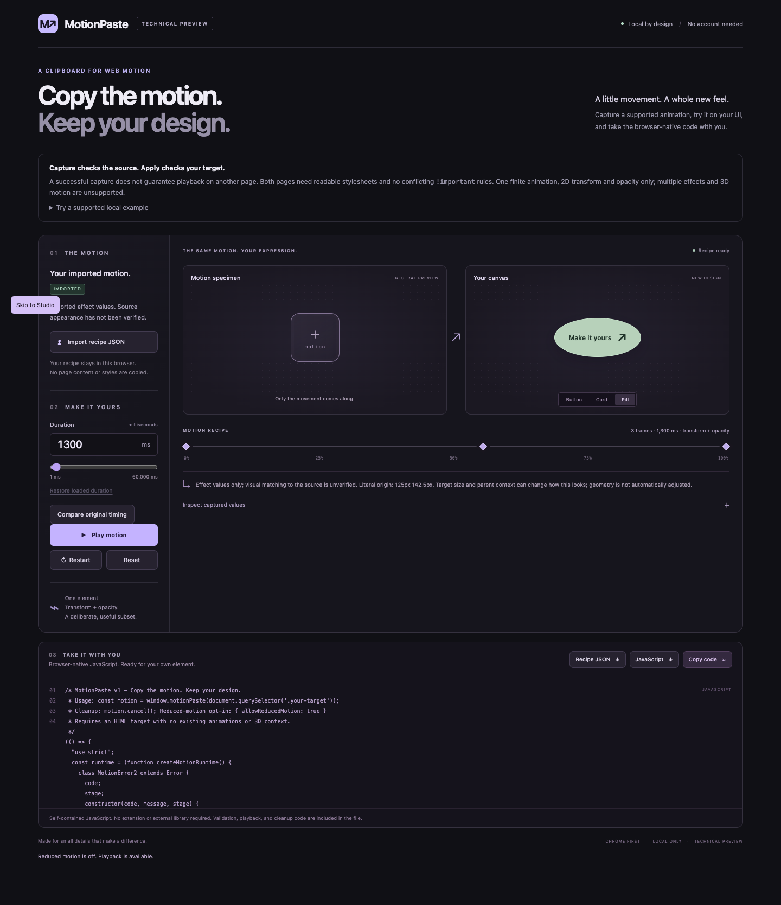

# MotionPaste

## Copy the motion. Keep your design.

Capture a **supported animation from your own web app**, change its timing, and reuse it on a different UI—with self-contained JavaScript.

**[Download the Chrome beta ZIP](https://github.com/spacegiyou/motionpaste/releases/download/v0.1.0-beta.3/motionpaste-0.1.0-beta.3.zip)** · [Watch the 15-second demo](docs/assets/MotionPaste-promo.mp4) · [Supported scope](#supported-scope) · [한국어 안내](00_START_HERE_KO.md)

[](docs/assets/MotionPaste-promo.mp4)

**Capture → retime → export.** The demo reuses one motion on two different designs and changes its duration from 1,300 to 733 ms. Actual beta.3 recordings with normal-speed cuts; not a setup-time claim.

No account. No model calls. No external library needed to run the exported JavaScript. [MIT licensed](LICENSE).

> **Experimental Chrome beta—not a website copier.** One supported CSS Animation or WAAPI effect; explicit 2D transform/opacity. Capture and destination checks can reject unsupported pages. Install with **Load unpacked**; not yet in the Chrome Web Store.

[](https://github.com/spacegiyou/motionpaste/actions/workflows/ci.yml)

## Try it

1. Download `motionpaste-0.1.0-beta.3.zip` from the [release](https://github.com/spacegiyou/motionpaste/releases/tag/v0.1.0-beta.3) and unzip it into a permanent folder.
2. Open `chrome://extensions`, enable **Developer mode**, choose **Load unpacked**, and select the folder containing `manifest.json`.
3. Pin MotionPaste. Open your own HTTP(S) app, click the toolbar icon → **Capture motion**, then select an animated HTML element. Escape cancels selection.
4. Studio opens. Play the captured motion, switch between Button / Card / Pill, edit the duration, and download JSON or JavaScript.

No Chrome Web Store installation is available yet. Chrome 120 is the manifest installation floor; tested environments and limitations are recorded in [verification](docs/VERIFICATION.md).

For a known supported example, [clone this repository](https://github.com/spacegiyou/motionpaste), use Node **22.13+ within the 22.x line, or Node 24+**, and run:

```sh
npm ci
npm run build
npm run dev
```

Open [the source example](http://127.0.0.1:4173/fixtures/source-app/), capture the green card, then try a duration of `733` ms. The fixture server listens only on loopback. The example imports neither the capture core nor Studio.

## Use the exported motion

Load the downloaded JavaScript in your page, then call:

```js
const motion = window.motionPaste(document.querySelector('.your-button'));
// Later: cancel this animation and restore only the origin value it still owns.
motion.cancel();
```

**Self-contained JavaScript. No extension or external library required.** The download contains validation, playback, and cleanup code. Loading it does not start an animation; calling `motionPaste(target)` does.

The destination must be a connected HTML element without existing animations. Playback respects reduced-motion preferences; an explicit per-call override is available as `{ allowReducedMotion: true }`.

Studio distinguishes **CAPTURED**, **IMPORTED**, and **EDITED** recipes. **Compare original timing** plays the loaded timing beside your edit; **Restore loaded duration** restores exactly what was loaded. JSON and JavaScript retain precise values such as 733 ms or 2,333 ms.

## Supported scope

| Supported | Outside this beta |
| --- | --- |
| One HTML element and one CSS Animation or WAAPI effect | Multiple effects, CSS transitions, pseudo-elements, SVG |
| Explicit transform/opacity endpoints | Color, layout, filters, implicit endpoints |
| Absolute-pixel 2D translate, rotate, scale, matrix | Relative units, variables, 3D, motion paths |
| Finite timing, ordinary document timeline, rate 1 | Infinite loops, scroll timelines, other playback rates |
| `fill: both`, replace composition | Other fill modes, additive composition |
| Inspectable document styles | Unreadable cross-origin stylesheets, overriding `!important`, shadow/slotted targets |
| Duration edits, recipe JSON, standalone JavaScript | Canvas, WebGL, GSAP inference, cloud, AI |

Capture success is not a guarantee that an arbitrary destination can apply the result. Errors distinguish **CAPTURE** from **APPLY** and retain the reason code. The destination is checked again for inaccessible CSS, conflicting styles, existing motion, and unsupported context. Source and target sizes or ancestor transforms can change the visible result.

Opacity-only motion leaves the destination's transform origin alone. Cleanup preserves later caller edits, including when separately exported scripts overlap. Unsupported input produces an explanation instead of a substitute preset.

## Verification and development

```sh
npm ci
npx playwright install chromium
npm run verify
```

`verify` runs all 15 stages, including formatting, lint, types, unit tests, evidence/packaging tests, server checks, coverage, build, actual extension capture, authorization, forced worker restart, browser guards, archive smoke, Studio UI, and downloaded-JavaScript parity. Missing or failed evidence cannot produce the supported-scope PASS. Raw observations, negative controls, required stages, timestamps, archive hashes, and generated summaries are checked together.

GitHub Actions runs core checks on Node 22 and 24, plus full Chromium verification on Ubuntu with Node 24. The [workflow](.github/workflows/ci.yml) has read-only repository permissions and does not publish releases. Check the [actual run status](https://github.com/spacegiyou/motionpaste/actions) before treating CI as passed.

A local source package can be produced after a successful verification:

```sh
node scripts/package-source.mjs
```

Its publication allowlist excludes supplied reference material, raw execution logs, and working artifacts. Historical regression fixtures retain their observed test data with local archive paths replaced by relative paths; they are test inputs, not new browser evidence.

[Verification and review scope](docs/VERIFICATION.md) · [35-second demo](docs/assets/MotionPaste-demo.mp4) · [Architecture](docs/ARCHITECTURE.md) · [Security](SECURITY.md) · [Contributing](CONTRIBUTING.md)

## Project map

| Path | Purpose |
| --- | --- |
| `src/core/` | Recipe validation, capture, playback, cleanup, standalone export |
| `src/extension/` | MV3 worker, picker, popup |
| `src/studio/` | Local editing and preview UI |
| `fixtures/` | Independent source and consumer apps |
| `tests/`, `scripts/` | Regression tests, browser verification, build and packaging |
| `docs/` | Architecture, evidence summary, demo assets and dependency licenses |

[MIT License](LICENSE). See [dependency licenses](docs/DEPENDENCIES.json) for development tools. The extension has no external runtime dependencies.
